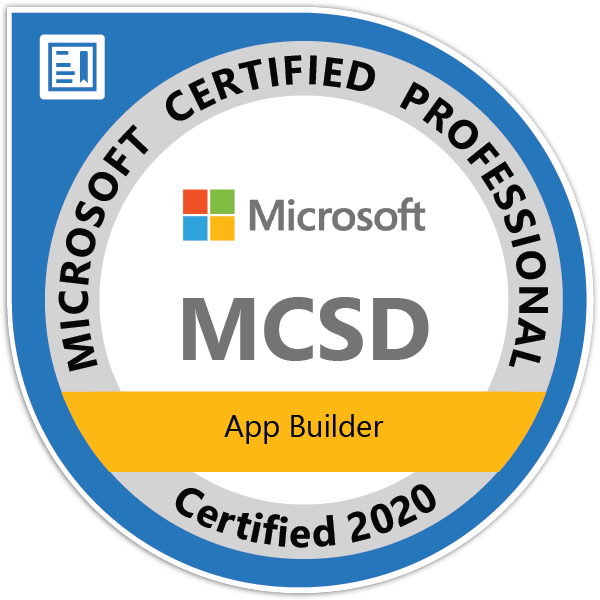
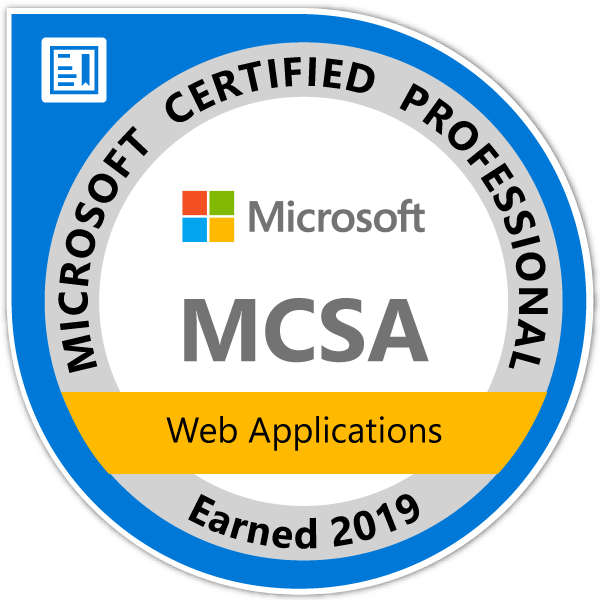
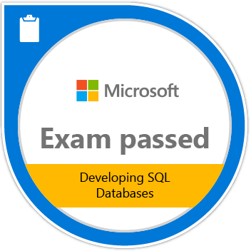

# Dados Pessoais
## Stanley Dias Paulo 
* :triangular_flag_on_post: Rua 509 Quadra 11 Lote 13, Jardim Monte Serrat, Aparecida de Goiânia - GO
* :iphone: `(62) 99134-1448`
* :email: `stanleydiaspaulo@gmail.com`
* :family: `Esposa` e `Filho`

# Perfil
Olá, sou bacharel em Sistemas de Informação, desenvolvedor, amante de tecnologia e apaixonado por conhecimento. Sou bastante curioso e entusiasta de novas tecnologias, busco sempre estar atualizado com as tendências de mercado.

# Objetivo
Promover o crescimento de minha carreira profissional, aprender o mais rápido possível todas as atribuições do cargo para poder mostrar resultados.

# :mortar_board: Educação
### SISTEMAS DE INFORMAÇÃO
#### FACULDADE SUL-AMERICANA - CONCLUSÃO 02/2012
* No projeto de conclusão de curso desenvolvemos um sistema de controle de acesso de pessoas com autenticação biométrica, onde utilizamos a linguagem de desenvolvimento C# e banco de dados SQL Server.

# 👨‍💻Principais Habilidades
* Desenvolvedor com vasta experiência em práticas de programação, análise e interpretação de requisitos de software com mais de 10 anos de mercado;
* Experiência em desenvolvimento e manutenções de aplicações `ERP`;
* Conhecimentos em arquitetura de software:

    
    
    
    
    
    
    
    
* Conhecedor das metodologias e processos de desenvolvimentos agéis e experiência como ;
* Linguagens de programação:

    
    
     
    
    
    
    
    
* Banco de dados:

    
    
    

* Frameworks

    
    
    
    
    
    

# 👨‍💼Experiência
#### GLOBALTEC SA
* Período: `09-2010` até o momento

#### VMSET SISTEMAS DE INFORMÁTICA LTDA ME
* Período: `05-2010` a `08-2010`

# Especializações
* Engenharia de Software - Incompleto

# ⭐Certificações

    
<b>MCSD - App Builder - Certified 2020</b>

        <table>
            <tr><td><a href="https://www.youracclaim.com/badges/9ea715fb-7ca6-41ad-aa98-588a4133c1a5/linked_in_profile">Verificar</a></td></tr>
            <tr><td></td></tr>
        </table>       

    
<b>MCSA – App Web – Certified 2019</b>

        <table>
            <tr><td><a href="https://www.youracclaim.com/badges/a04d7fa8-4da3-41b7-97f9-48379b81339d/linked_in_profile">Verificar</a></td></tr>
            <tr><td></td></tr>
        </table>       

    
<b>Exam 762: Developing SQL Databases</b>

        <table>
            <tr><td><a href="https://www.youracclaim.com/badges/3f3634c0-d0de-4bd7-a092-10fed5fa77ef?source=linked_in_profile">Verificar</a></td></tr>
            <tr><td></td></tr>
        </table>       

    
<b>Exam 487: Developing Microsoft Azure and Web Services</b>

        <table>
            <tr><td><a href="https://www.youracclaim.com/badges/fc708740-03c3-4c77-8f65-daf7d873e816">Verificar</a></td></tr>
            <tr><td></td></tr>
        </table>       

    
<b>Exam 486: Developing ASP.NET MVC Web Applications</b>

        <table>
            <tr><td><a href="https://www.youracclaim.com/badges/3080933a-2efa-4324-aa62-b3514d48a706">Verificar</a> </td></tr>
            <tr><td></td></tr>
        </table>       

    
<b>Exam 483: Programming in C#</b>

        <table>
            <tr><td><a href="https://www.youracclaim.com/badges/12f84070-acee-482d-8cd2-a41d742243e3">Verificar</a></td></tr>
            <tr><td></td></tr>
        </table>       

# 🏷️Cursos

    
<b>Formação C# Programming </b> 

        <table>
            <tr><td><strong>Certificação C# Programming parte 1: Criar tipos</strong></td></tr>
            <tr><td>Tipos integrais</td></tr>
            <tr><td>Ponto flutuante, booleanos, structs e enums </td></tr>
            <tr><td>Criar tipos de referência </td></tr>
            <tr><td>Classes, métodos, métodos de extensão </td></tr>
            <tr><td>Criar métodos sobrecarregados e substituídos </td></tr>
            <tr><td><strong>Certificação C# Programming parte 2: Consumir tipos</strong> </td></tr>
            <tr><td>Box ou unbox para converter entre tipos de valor </td></tr>
            <tr><td>Cast de tipos </td></tr>
            <tr><td>Implementando conversões </td></tr>
            <tr><td>Lidar com tipos dinâmicos </td></tr>
            <tr><td>Adicionando membros dinamicamente </td></tr>
            <tr><td><strong>Certificação C# Programming parte 3: Encapsulamento e Hierarquia de Classes</strong> </td></tr>
            <tr><td>Propriedades e acessadores </td></tr>
            <tr><td>Projetar interfaces </td></tr>
            <tr><td>Interfaces explícitas </td></tr>
            <tr><td>Classe base </td></tr>
            <tr><td>Comparações entre objetos </td></tr>
            <tr><td><strong>Certificação C# Programming parte 4: Fluxo de programa e exceções</strong> </td></tr>
            <tr><td>Fluxo de programa If, Else, Switch </td></tr>
            <tr><td>Compilação condicional </td></tr>
            <tr><td>Fluxo de programa While e Do </td></tr>
            <tr><td>Interação com For e Foreach </td></tr>
            <tr><td>Manutenção de exceções </td></tr>
            <tr><td>Exceções com SQL Server e Rede </td></tr>
            <tr><td><strong>Certificação C# Programming parte 5: Strings e Ciclo de Vida de Objetos</strong> </td></tr>
            <tr><td>Gerenciamento de memória </td></tr>
            <tr><td>Coletando lixo </td></tr>
            <tr><td>O Padrão Disposable </td></tr>
            <tr><td>Concatenação, Escrita e Leitura de Strings </td></tr>
            <tr><td>Pesquisando Strings </td></tr>
            <tr><td>Formatação de Strings </td></tr>
            <tr><td><strong>Certificação C# Programming parte 6: Coleções, XML e JSON</strong> </td></tr>
            <tr><td>Serialização com XML </td></tr>
            <tr><td>Serialização com JSON </td></tr>
            <tr><td>Serialização Binária, Personalizada e com Contrato </td></tr>
            <tr><td>Arrays </td></tr>
            <tr><td>Listas </td></tr>
            <tr><td>Conjuntos, Dicionários e Filas </td></tr>
            <tr><td><strong>Certificação C# Programming parte 7: Eventos e LINQ</strong> </td></tr>
            <tr><td>Introdução aos eventos </td></tr>
            <tr><td>Manipuladores de eventos </td></tr>
            <tr><td>Delegados e Lambda </td></tr>
            <tr><td>Func, Action e Predicate </td></tr>
            <tr><td>Consultado e filtrando dados com LINQ </td></tr>
            <tr><td>Projeção de dados </td></tr>
            <tr><td>Agrupamento e agregação </td></tr>
            <tr><td>Paginação e sintaxe de método </td></tr>
            <tr><td>Consulta com XML </td></tr>
            <tr><td><strong>Certificação C# Programming parte 8: Entrada e Saída de Dados</strong> </td></tr>
            <tr><td>Ler e gravar bytes em fluxos de arquivos </td></tr>
            <tr><td>Ler e gravar strings em fluxos de arquivos </td></tr>
            <tr><td>Gerenciando arquivos </td></tr>
            <tr><td>Gerenciando diretórios </td></tr>
            <tr><td>Acessando a Web de forma assíncrona </td></tr>
            <tr><td>Lendo e atualizando banco de dados </td></tr>
            <tr><td>Consumindo serviços e interpretando dados </td></tr>
            <tr><td><strong>Certificação C# Programming parte 9: Depurar Aplicativos</strong> </td></tr>
            <tr><td>Gerenciando assemblies </td></tr>
            <tr><td>Assinando assemblies com nome forte </td></tr>
            <tr><td>Depurando aplicações </td></tr>
            <tr><td>Compilação condicional </td></tr>
            <tr><td>Compilação em modo debug e release </td></tr>
            <tr><td>Rastreamento de aplicações </td></tr>
            <tr><td>Gravando mensagens no Event Log </td></tr>
            <tr><td>Contadores de desempenho </td></tr>
            <tr><td><strong>Certificação C# Programming parte 10: Reflection</strong> </td></tr>
            <tr><td>Criar e aplicar atributos </td></tr>
            <tr><td>Ler os atributos </td></tr>
            <tr><td>Usar reflection </td></tr>
            <tr><td>Geração de código </td></tr>
            <tr><td>Tipos do System Reflection </td></tr>
            <tr><td><strong>Certificação C# Programming parte 11: Multithreading</strong> </td></tr>
            <tr><td>Introdução ao Task Parallel Library </td></tr>
            <tr><td>Consultas LINQ com Paralelismo </td></tr>
            <tr><td>Espera, Continuação de Hierarquia de Tarefas </td></tr>
            <tr><td>Threads </td></tr>
            <tr><td>Desbloqueando a interface do usuário </td></tr>
            <tr><td>Async Await, Coleções simultâneas e bloqueios </td></tr>
            <tr><td>Cancelamento de tarefas e métodos Thread Safe </td></tr>
            <tr><td><strong>Certificação C# Programming parte 12: Validar Segurança</strong> </td></tr>
            <tr><td>Validar dados JSON </td></tr>
            <tr><td>Escolher o tipo de coleção adequada </td></tr>
            <tr><td>Validando com expresão regular </td></tr>
            <tr><td>Funções internas para validar tipos e conteúdos </td></tr>
            <tr><td>Criptografia simétrica e assimétrica </td></tr>
            <tr><td>Gerenciamento de chave </td></tr>
            <tr><td>Gerenciar e criar certificados </td></tr>
            <tr><td>Fazendo Hash de dados </td></tr>
        </table>

    
<b>Front-end</b>

    <table>
        <tbody>
            <tr><td><strong>Gulp: automação de tarefas front-end</strong></td></tr> 
            <tr><td><strong>React parte 1: Componentes reutilizáveis para sua webapp</strong></td></tr> 
            <tr><td><strong>React parte 2: Validação, Rotas e Integração com API</strong></td></tr> 
            <tr><td><strong>SQL Server: T-SQL com Microsoft SQL Server 2017</strong></td></tr> 
            <tr><td><strong>GraphQL parte 3: integrando com sua aplicação</strong></td></tr> 
        </tbody>
    </table>

    
<b>Formação: React JS</b>

    <table>
        <tbody>
            <tr><td><strong>Fetch API: Consumindo uma API Rest com JavaScript</strong></td></tr> 
            <tr><td><strong>JS na Web: Criando uma SPA com JavaScript puro</strong></td></tr> 
            <tr><td><strong>JavaScript: Programando a Orientação a Objetos</strong></td></tr> 
            <tr><td><strong>JavaScript: Interfaces e Herança em Orientação a Objetos</strong></td></tr> 
            <tr><td><strong>React: Entendendo como a biblioteca funciona</strong></td></tr> 
            <tr><td><strong>React: Ciclo de vida dos componentes</strong></td></tr> 
            <tr><td><strong>React:Function Components, uma abordagem moderna</strong></td></tr> 
            <tr><td><strong>React: Hooks, Contextos e boas práticas</strong></td></tr> 
        </tbody>
    </table>

    
<b>Formação: Node.JS</b>

    <table>
        <tbody>
            <tr><td><strong>Performance Web I: otimizando o front-end</strong></td></tr> 
            <tr><td><strong>Performance Web II: Critical Path, HTTP/2 e Resource Hints</strong></td></tr> 
            <tr><td><strong>HTTP: Entendendo a web por baixo dos panos</strong></td></tr> 
            <tr><td><strong>Node.js Parte 1: Inovando com JavaScript no backend</strong></td></tr> 
            <tr><td><strong>Node.js Parte 2: MVC, autenticação e autorização</strong></td></tr> 
            <tr><td><strong>GraphQL Parte 1: Primeiros Passos</strong></td></tr> 
            <tr><td><strong>GraphQL parte 2: Substituindo uma API REST por GraphQL</strong></td></tr> 
            <tr><td><strong>Rest com NodeJS: API com Express e MySQL</strong></td></tr> 
        </tbody>
    </table>

    
<b>Formação: SQL com Microsoft SQL Server 2017</b>

    <table>
        <tbody>
            <tr><td><strong>SQL Server: Introdução ao SQL com Microsoft SQL Server 2017</strong></td></tr> 
            <tr><td><strong>SQL Server: Consultas avançadas com Microsoft SQL Server 2017</strong></td></tr> 
            <tr><td><strong>SQL Server: Manipulação de dados com Microsoft SQL Server 2017</strong></td></tr> 
            <tr><td><strong>SQL Server: T-SQL com Microsoft SQL Server 2017</strong></td></tr> 
            <tr><td><strong>SQL Server: Administração do Microsoft SQL Server 2017</strong></td></tr> 
        </tbody>
    </table>

    
<b>Formação Power BI</b>

    <table>
        <tbody>
            <tr><td><strong>Business Intelligence: Introdução à inteligência empresarial</strong></td></tr> 
            <tr><td>Dados e informação </td></tr>
            <tr><td>Problema comuns nas empresas </td></tr>
            <tr><td>Matriz dimensão indicador </td></tr>
            <tr><td>Tabelas de um Datawarehouse </td></tr>
            <tr><td>Hierarquias e tipo de dimensões </td></tr>
            <tr><td>O que é OLAP? </td></tr>
            <tr><td>Outros tópicos </td></tr>
            <tr><td><strong>ETL com integration services: Modelo de dados </strong></td></tr>
            <tr><td>Compreendendo o problema </td></tr>
            <tr><td>Instalando os produtos </td></tr>
            <tr><td>O projeto do Data Warehouse </td></tr>
            <tr><td>As dimensões fábrica, cliente e produto </td></tr>
            <tr><td>Dimensões organizacional e tempo </td></tr>
            <tr><td>As tabelas fato </td></tr>
            <tr><td>Carregando dados na dimensão </td></tr>
            <tr><td><strong>ETL com integration services: Transformação de dados </strong></td></tr>
            <tr><td>Carregando dimensão cliente </td></tr>
            <tr><td>Preparando a dimensão produto </td></tr>
            <tr><td>A dimensão organizacional </td></tr>
            <tr><td>Criando a dimensão tempo </td></tr>
            <tr><td>Tabelas de fato </td></tr>
            <tr><td>Conclusão </td></tr>
            <tr><td><strong>OLAP com SQL Server: Construção do Data Warehouse </strong></td></tr>
            <tr><td>Configuração </td></tr>
            <tr><td>DW criando as primeiras dimensões </td></tr>
            <tr><td>Snow Flake, Tempo e Pai-Filho </td></tr>
            <tr><td>Criando os OLAPs </td></tr>
            <tr><td>Desnormalizando base de dados </td></tr>
            <tr><td><strong>Consultas Multidimensionais: MDX com SQL Server </strong></td></tr>
            <tr><td>Configuração </td></tr>
            <tr><td>Seleção de elementos </td></tr>
            <tr><td>Ordem da exibição de elementos </td></tr>
            <tr><td>Cálculos nos Elementos do OLAP </td></tr>
            <tr><td>Períodos de Tempo </td></tr>
            <tr><td>Trabalhando com dados ordenados </td></tr>
            <tr><td>Análise de Pareto ou 80 20 </td></tr>
            <tr><td><strong>Report Analysis com Power BI: Gerando relatórios empresariais </strong></td></tr>
            <tr><td>Configurando o ambiente </td></tr>
            <tr><td>Conceitos, acesso e construção de uma visão simples </td></tr>
            <tr><td>Concstruindo relatórios </td></tr>
            <tr><td>Hierarquias, mapas e tabelas </td></tr>
            <tr><td>Power BI Service</td></tr>
        </tbody>
    </table>

    
<b>Git e GitHub: Controlando e compartilhando seu código</b>

    <table>
        <tbody>
            <tr><td>O que é o Git e como instalá-lo</td></tr>
            <tr><td>Criar um repositório</td></tr>
            <tr><td>Analise de status do repositório</td></tr>
            <tr><td>Entendendo o comando commit</td></tr>
            <tr><td>Como adicionar arquivos com git add</td></tr>
            <tr><td>Verificar históricos de commits</td></tr>
            <tr><td>Ignorando arquivos e/ou pastas com .gitignore</td></tr>
            <tr><td>Repositórios remotos</td></tr>
            <tr><td>Adicionando link para o repositório remoto com 'remote add'</td></tr>
            <tr><td>Como baixar um repositório pela primeira vez</td></tr>
            <tr><td>Clonando-o com o comando git clone</td></tr>
            <tr><td>Enviando as alterações para um repositório remoto com o comando git push</td></tr>
            <tr><td>Atualizando o repositório remoto utilizando git pull</td></tr>
            <tr><td>O que é para que serve o GitHub</td></tr>
            <tr><td>Entendo o que é uma branch</td></tr>
            <tr><td>Visualizando as alterações realizadas com o comando git diff</td></tr>        
        </tbody>
    </table>

    
<b>Git e GitHub: Estratégias de ramificação, Conflitos e Pull Requests</b>

    <table>
        <tbody>
            <tr><td>O que são e como utilizar <strong>issues</strong></td></tr>
            <tr><td>Que as issues podem ser utilizadas para vários propósitos
            <ul>
                <li>Reportar problemas</li>
                <li>Sugerir melhorias</li>
                <li>Solicitar novas funcionalidades</li>
                <li>Organizar qualquer coisa que faça sentido para o projeto</li>
                <li>e outros</li>
            </ul>
            </td></tr>
            <tr><td>O que são <strong>pull requests</strong></td></tr>
            <tr><td>Como unir vários commits em um, utilizando o comando <strong>git rebase -i</strong></td></tr>
            <tr><td>Como enviar e como revisar um pull request no GitHub</td></tr>
            <tr><td>
                Controle avançado de conflitos
                <ul>
                    <li>Que o comando git <strong>cherry-pick</strong> pode trazer um commit específico para a branch atual</li>
                    <li>Como encontrar o commit em que determinada alteração foi aplicada, utilizando o <strong>git bisect</strong></li>
                    <li>Como encontrar o responsável por determinanda linha ou bloco de código, utilizando o <strong>git blame</strong></li>
                    <li>Que jamais devemos apontar um culpado por determinado bug. Uma equipe deve ser unida e se ajudar</li>
                    <li>Que o comando <strong>git show {hash}</strong>  mostra todas as alterações aplicadas pelo commit com o hash informado.</li>
                </ul>
            </td></tr>
            <tr><td>
            Estratégias de branching
            <ul>
                <li>Que é uma convensão bem seguida que a branch <strong>master</strong> tenha apenas os commits prontos para ir para produção</li>
                <li>Que não é interessante realizar trabalho e commitar diretamente na branch <strong>master</strong></li>
                <li>Como remover uma branch</li>
                <ul>
                    <li><strong>git branch -d {nome_branch}</strong> remove uma branch que já tem seu trabalho unido à branch atual</li>
                    <li><strong>git branch -D {nome_branch}</strong> remove uma branch mesmo que os commits desta branch ainda não estejam na branch atual, ou seja, força a remoção;</li>
                </ul>
                <li>Um pouco do processo chamado de <strong>Git Flow</strong></li>
                <ul>   
                    <li>Entendemos que o estado do código representado pela branch <strong>master</strong> deve ser o mesmo que estará em produção</li>
                    <li>Vimos que deve haber uma branch de desenvolvimento (comument chamado de <strong>develop</strong>), onde todas as funcionalidades e correções devem ser muito bem testada antes de ir para produção <strong> master</strong></li>
                    <li>Vimos que cada funcionalidade deve ser feita em uma branch separada, e que é comum que esta branch tenha <strong>feature/</strong> como prefixo</li>
                    <li>Aprendemos também que bugs normalmente são corrigidos em <strong>hotfix/</strong></li>
                    <li>Além disso, branches específicas para cada release são criadas para realizar os testes e correções de bugs específicos</li>
                </ul>
            </ul>
            </td></tr>
            <tr><td>
            Ferramentas visuais
                <ul>
                    <li>Existem ferramentas visuais que podem nos auxiliar com o trabalho com o Git;</li>
                    <li>O <strong>Git Cola</strong> foi uma das primeiras ferramentas visuais multiplataforma. Embora não seja a mais complexa ou visualmente atraente, é bem completa e pode nos ajudar bastante</li>
                    <li>O <strong>Git Desktop</strong> pode ser interessante para gerenciar os projetos do GitHub de forma mais ágil e facilitada, sem a necessidade de acessar o site;</li>
                    <li>O <strong>GitKraken</strong> é uma ferramenta extremamente completa, que nos auxilia inclusive com a implementação do <strong>Git Flow</strong></li>
                </ul>
            </td></tr>
            <tr><td>
                Hooks e dploy com Git
                <ul>
                    <li>Que o Git trabalha com eventos e os chama de <strong>hooks;</strong></li>
                    <li>Que podemos definir códigos a serem executados quando determinado evento (hook) ocorrer</li>
                    <li>A criar hooks dentro da pasta <strong>.git/hooks</strong>, utilizando <strong>Shell Script</strong></li>
                    <li>Que o nome do arquivo indica em qual hook (evento) ele será executado;</li>
                    <li>Que, com hooks, podemos executar os testes automatizados do nosso código, ou até mesmo colocar uma aplicação em produção</li>
                </ul>
            </td></tr>
        </tbody>
    </table>    

    
<b>Introdução ao Entity Framework Core</b>

    <table>
        <tbody>
            <tr><td>Introdução</td></tr>
            <tr><td>O que é um ORM?</td></tr>
            <tr><td>Orientação a objetos vs Modelo relacional</td></tr>
            <tr><td>O que é o Entity Framework Core?</td></tr>
            <tr><td>Como funciona o Entity Framework</td></tr>
            <tr><td>História do Entity Framework Core</td></tr>
            <tr><td>Por que o Entity Framework core foi reescrito do zero</td></tr>
            <tr><td>Quais são os providers disponíveis</td></tr>
            <tr><td>EF6 vs EF Core</td></tr>
            <tr><td>Ambiente de desenvolvimento - IDE's</td></tr>
            <tr><td>IDE's disponíveis</td></tr>
            <tr><td>Instalação do SDK do .NET Core</td></tr>
            <tr><td>Instalação das extensões do VS Code</td></tr>
            <tr><td>Instalação do SQL Server LocalBD</td></tr>
            <tr><td>Desenvolvendo a primeira aplicação</td></tr>
            <tr><td>Criando uma aplicação console no Visual Studio</td></tr>
            <tr><td>Instalando o pacote do SQL Server Visual Studio Code</td></tr>
            <tr><td>Instalando o pacote do SQL Server Visual Studio</td></tr>
            <tr><td>Coceitos Principais</td></tr>
            <tr><td>Por onde começar</td></tr>
            <tr><td>O que é Code First</td></tr>
            <tr><td>O que é Database First</td></tr>
            <tr><td>O que é DbContext</td></tr>
            <tr><td>Cenários de utilização</td></tr>
            <tr><td>Sistemas de pedido</td></tr>
            <tr><td>Criação das classes</td></tr>
            <tr><td>Criação da classe de contexto</td></tr>
            <tr><td>Mapeamento através do Fluent API</td></tr>
            <tr><td>Arquivos de configurações</td></tr>
            <tr><td>Utilizando DataAnnotations</td></tr>
            <tr><td>Migrações</td></tr>
            <tr><td>O que é necessário para criar uma migração,</td></tr>
            <tr><td>Criando a primeira migração</td></tr>
            <tr><td>Analisando a migração</td></tr>
            <tr><td>Gerando Script SQL</td></tr>
            <tr><td>Aplicando migração</td></tr>
            <tr><td>Gerando Scripts SQL Idempotentes</td></tr>
            <tr><td>Roolbak de migrações</td></tr>
            <tr><td>Migrações pendentes</td></tr>
            <tr><td>Operações</td></tr>
            <tr><td>Operações que iremos executar</td></tr>
            <tr><td>Inserindo registros</td></tr>
            <tr><td>Inserindo registros em massa</td></tr>
            <tr><td>Consultando dados</td></tr>
            <tr><td>Carregando adiantado</td></tr>
            <tr><td>Atualizando registros</td></tr>
            <tr><td>Removento registros</td></tr>
            <tr><td>Bônus</td></tr>
            <tr><td>Detectando propriedades não configuradas</td></tr>
            <tr><td>Resiliência da conexão</td></tr>
            <tr><td>Alterando o nome da tabela de histórico de migrações</td></tr>
        </tbody>
    </table>

